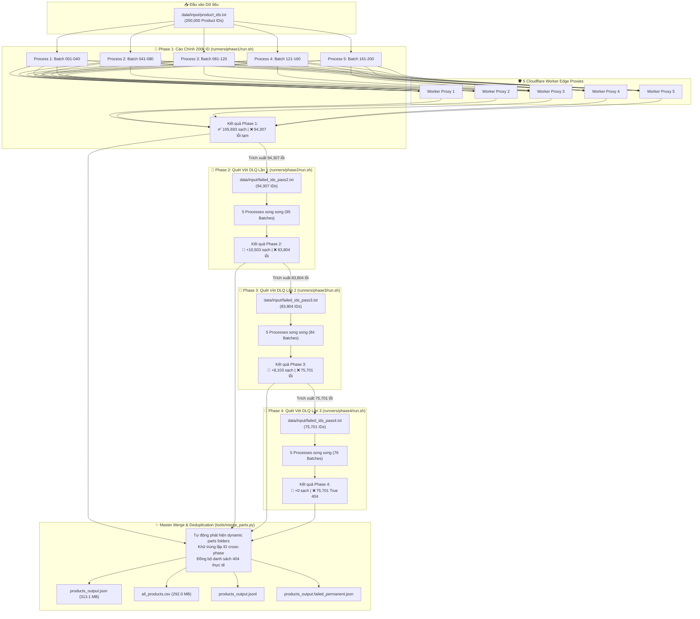

# 🛒 Tiki Product Data Crawler & Pipeline (Project 2 - Data Engineer)

Hệ thống crawl và chuẩn hóa dữ liệu lớn cho **200,000 sản phẩm** từ Tiki API (`https://api.tiki.vn/product-detail/api/v1/products/{id}`). Hệ thống được thiết kế với kiến trúc chịu lỗi (fault-tolerant), tối ưu hóa hiệu năng cao bằng lập trình bất đồng bộ (`asyncio` + `aiohttp`), tích hợp cơ chế chống thất thoát dữ liệu đa tầng (Durable Append, Atomic Writes, Multi-layer Checkpointing) và cơ chế vượt qua các lớp bảo vệ chống scraping (BytePlus WAF / Rate Limiter).

Dự án đã hoàn tất **100% (200,000 / 200,000 ID)** qua 4 Phase quét vét Dead Letter Queue (DLQ), thu thập thành công **124,299 sản phẩm sạch (62.15%)** và xác nhận chính xác **75,701 lỗi vĩnh viễn True 404 (37.85%)**.

---

## 📑 Mục Lục
1. [Cấu trúc thư mục dự án (Modular Architecture)](#1-cấu-trúc-thư-mục-dự-án-modular-architecture)
2. [Kiến trúc & Sơ đồ luồng hệ thống End-to-End (4-Phase Pipeline)](#2-kiến-trúc--sơ-đồ-luồng-hệ-thống-end-to-end-4-phase-pipeline)
3. [Quy chuẩn dữ liệu đầu ra & Làm sạch HTML](#3-quy-chuẩn-dữ-liệu-đầu-ra--làm-sạch-html)
4. [Bảng phân loại & Xử lý các trường hợp lỗi & WAF Cooldown](#4-bảng-phân-loại--xử-lý-các-trường-hợp-lỗi)
   - [Cơ chế WAF Adaptive Stepped Backoff (Tối ưu hóa thời gian quét lại)](#-cơ-chế-waf-adaptive-stepped-backoff-tối-ưu-hóa-thời-gian-quét-lại)
5. [Hướng dẫn cài đặt & Cách chạy Source Code](#5-hướng-dẫn-cài-đặt--cách-chạy-source-code)
   - [Bước 5: Chạy Phase 1 - Cào chính 200,000 ID](#bước-5-chạy-phase-1---cào-chính-200000-id)
   - [Bước 6: Chiến lược Quét vét lỗi đa tầng (Phase 2 -> 3 -> 4) & Generic Runner](#bước-6-chiến-lược-quét-vét-lỗi-đa-tầng-phase-2---3---4--generic-runner)
   - [Bước 7: Hợp nhất Toàn diện (Master Merge & Deduplication)](#bước-7-hợp-nhất-toàn-diện-master-merge--deduplication)
   - [Bước 8: Chạy ngầm tự động qua macOS LaunchAgent Daemon](#bước-8-chạy-ngầm-tự-động-qua-macos-launchagent-daemon)
6. [Báo cáo kết quả & Thống kê thời gian cào chi tiết](#6-báo-cáo-kết-quả--thống-kê-thời-gian-cào-chi-tiết)
7. [Xử lý sự cố (Troubleshooting)](#7-xử-lý-sự-cố-troubleshooting)
8. [Chạy Unit Test](#8-chạy-unit-test)

---

## 📁 1. Cấu trúc thư mục dự án (Modular Architecture)

Codebase được tái cấu trúc theo mô hình phân tầng module rõ ràng:

```
Project_2/
├── src/                              # Mã nguồn Python chính (Core Engine)
│   ├── main.py                       # CLI Entry point cào theo batch (hỗ trợ Adaptive Stepped Backoff)
│   ├── fetch_tiki_products.py        # Engine cào Concurrency (Checkpoint 5 lớp, Retry Queue, Dynamic Cooldown)
│   ├── crawler.py                    # Batch streaming crawler engine
│   ├── cleaner.py                    # Module chuẩn hoá description & bóc tách cấu trúc HTML
│   └── config.py                     # File cấu hình tập trung (URL, Headers, Timeouts, Paths)
├── tools/                            # Công cụ tiện ích & xử lý dữ liệu tổng hợp
│   ├── merge_parts.py                # Master Merge: Tự động phát hiện dynamic parts mọi Phase, khử trùng & xuất data
│   ├── extract_failed_ids.py         # Trích xuất danh sách ID lỗi Phase 1 -> failed_ids_pass2.txt
│   └── extract_failed_ids_pass3.py   # Trích xuất danh sách ID lỗi Phase 2 -> failed_ids_pass3.txt
├── monitor/                          # Bộ Dashboard giám sát thời gian thực
│   ├── check_retry.py                # Dashboard tổng quát (nhận tham số --name passX, --watch)
│   ├── check_status.py               # Dashboard giám sát Phase 1
│   ├── check_retry_pass1_status.py   # Wrapper dashboard Phase 1
│   ├── check_retry_pass2_status.py   # Dashboard giám sát Phase 2
│   ├── check_retry_pass3_status.py   # Dashboard giám sát Phase 3
│   └── check_retry_pass4_status.py   # Dashboard giám sát Phase 4
├── runners/                          # Bộ script điều phối thực thi 5 Process song song
│   ├── retry.sh                      # Generic Retry Runner chạy bất kỳ Phase nào
│   ├── stop_retry.sh                 # Generic Stop Runner dừng tiến trình an toàn
│   ├── phase1/                       # Điều phối Phase 1 (200k ID): run.sh, stop.sh, start.command
│   ├── phase2/                       # Điều phối Phase 2 (94k ID): run.sh, stop.sh, start.command
│   ├── phase3/                       # Điều phối Phase 3 (84k ID): run.sh, stop.sh, start.command
│   └── phase4/                       # Điều phối Phase 4 (76k ID): run.sh, stop.sh, start.command
├── scripts/                          # Script cấu hình hệ thống
│   └── setup_retry_daemon.sh         # Cài đặt macOS LaunchAgent Daemon tự chạy ngầm khi mở máy
├── tests/                            # Bộ kiểm thử đơn vị tự động (Unit Tests)
│   ├── test_crawler.py
│   └── test_fetch_tiki_products.py
├── data/
│   ├── input/                        # Danh sách ID đầu vào
│   │   ├── product_ids.txt           # 200,000 ID gốc ban đầu
│   │   ├── failed_ids_pass2.txt      # 94,307 ID lỗi trích xuất cho Phase 2
│   │   ├── failed_ids_pass3.txt      # 83,804 ID lỗi trích xuất cho Phase 3
│   │   └── failed_ids_pass4.txt      # 75,701 ID lỗi trích xuất cho Phase 4
│   └── output/                       # Thư mục lưu trữ kết quả độc lập từng Phase
│       ├── concurrency/              # Kết quả Phase 1 (parts/ 200 files + products_output.*)
│       ├── retry_pass2/              # Kết quả Phase 2 (parts/ 95 files)
│       ├── retry_pass3/              # Kết quả Phase 3 (parts/ 84 files)
│       ├── retry_pass4/              # Kết quả Phase 4 (parts/ 76 files)
│       └── all_products.csv          # File CSV tổng hợp toàn bộ 124,299 sản phẩm sạch
└── logs/                             # File log và PID của các tiến trình ngầm
```

---

## 🏗️ 2. Kiến trúc & Sơ đồ luồng hệ thống End-to-End (4-Phase Pipeline)

### 📊 Sơ đồ Tổng thể Pipeline



---

### Các Engine cào dữ liệu:

Hệ thống cung cấp **2 chế độ thực thi chính**:

#### 1. Concurrency Engine (`src/fetch_tiki_products.py`) - Khuyến nghị cho Production
- **Lập trình bất đồng bộ (`asyncio` + `aiohttp`)**: Quản lý connection pool với keep-alive, pacing request ngẫu nhiên tự nhiên (`NaturalPacer`).
- **Worker Pool có gắn nhãn**: Log mỗi request đều hiển thị `[Worker N]` để theo dõi worker nào đang xử lý ID nào. Hỗ trợ từ **1 đến 20 workers** đồng thời.
- **Cung cấp public API `run_product_ids()`**: Cho phép các module khác (như `src/main.py`) gọi trực tiếp engine với danh sách ID tùy chỉnh, tái sử dụng toàn bộ logic retry/checkpoint.
- **Cơ chế Checkpoint đa lớp**:
  - `products_output.jsonl`: Append từng bản ghi và `fsync` ngay lập tức chống mất dữ liệu khi crash/tắt đột ngột.
  - `products_output.progress.txt`: Tập hợp ID đã thành công giúp Resume tức thì mà không cần duyệt lại JSON lớn.
  - `products_output.json`: File tổng hợp được cập nhật bằng cơ chế **Atomic Write** (ghi ra `.tmp` rồi rename/replace), đảm bảo không bao giờ bị corrupt.
  - `products_output.retry.json`: Quản lý số lần thử (`attempts`), lý do lỗi (`reason`), thời điểm retry (`next_retry_at`) và cooldown toàn cục (`_global`).
  - `products_output.failed_permanent.json`: Tách riêng các ID không thể cào (404, payload sai định dạng, đã hết lượt retry).
  - `products_output.stats.json`: Ghi nhận và tích lũy tổng thời gian cào qua nhiều lần chạy, tính tốc độ trung bình.

#### 2. Batch Streaming Engine (`src/main.py`)
- **Tự động chia file theo Batch**: Cứ mỗi `--batch-size` (mặc định 1,000) sản phẩm sẽ đóng gói thành một file riêng (`products_part_0001.json`, `products_part_0002.json`, ...) trong thư mục `data/output/concurrency/parts/` (hoặc `data/output/retry_passX/parts/`).
- **Log trạng thái chi tiết từng batch**: Trước và sau mỗi batch đều in ra số lượng `success`, `permanent_failed`, `due`, `pending_retry` và `cooldown` để theo dõi tiến độ toàn pipeline.
- **Tích hợp Adaptive Stepped Backoff**: Tự động xử lý thông minh khi hết cooldown WAF, không cần con người can thiệp.

#### 3. Sequential Engine (`fetch_tiki_products_sequential.py`)
- **Cào tuần tự từng sản phẩm**: Sử dụng để debug sâu, kiểm tra phản hồi header/body chi tiết của server Tiki khi gặp lỗi.

---

## 📋 3. Quy chuẩn dữ liệu đầu ra & Làm sạch HTML

Mỗi bản ghi sản phẩm được lưu trữ theo cấu trúc chuẩn JSON sau:

```json
{
  "id": 138083218,
  "name": "Đồ Chơi Xếp Hình MyndToys - My First Learning (Cho Bé Từ 2.5 Tuổi - Nhiều Chủ Đề)",
  "url_key": "do-choi-xep-hinh-myndtoys-my-first-learning-cho-be-tu-2-5-tuoi-nhieu-chu-de-p138083218",
  "price": 268000,
  "description": "Đồ Chơi Xếp Hình MyndToys - My First Learning (Cho Bé Từ 2.5 Tuổi - Nhiều Chủ Đề)\n\nĐặc điểm nổi bật:\n- Chất liệu gỗ an toàn cho bé\n- Giúp phát triển tư duy logic",
  "images_url": [
    "https://salt.tikicdn.com/media/catalog/product/f5/15/2228f38cf84d1b8451bb49e2c4537081.png"
  ]
}
```

### Quy trình chuẩn hóa `description` trong `cleaner.py`:
- **Loại bỏ thẻ rác**: Xóa sạch toàn bộ thẻ `<script>`, `<style>`, `<iframe>` cùng nội dung bên trong.
- **Bóc tách khối HTML**: Chuyển các thẻ khối (`<p>`, `<div>`, `<li>`, `<h1>`-`<h6>`, `<br>`) thành dấu xuống dòng `\n` có nghĩa.
- **Giải mã HTML Entities**: Chuyển đổi các ký tự mã hóa như `&nbsp;`, `&amp;`, `&quot;`, `&lt;`, `&gt;`, `&#39;` thành ký tự văn bản thông thường.
- **Làm sạch khoảng trắng**: Loại bỏ khoảng trắng không ngắt (`\xa0`, `\u200b`), chuẩn hóa khoảng trắng thừa giữa các dòng và đoạn văn.

---

## ⚠️ 4. Bảng phân loại & Xử lý các trường hợp lỗi

Mọi phản hồi từ Tiki API đều được phân loại nghiêm ngặt thành **3 nhóm trạng thái**:

| Nhóm | Mã `reason` ghi nhận | Nguyên nhân chi tiết | Cơ chế xử lý & Retry | File lưu trữ |
| :--- | :--- | :--- | :--- | :--- |
| **`challenge`** | `html_security_challenge` | BytePlus / Tiki WAF phát hiện bot, trả về trang HTML chứa Security Check/Captcha thay vì JSON. | Ngắt toàn bộ worker ngay lập tức (`stop_event`), bật `_global` cooldown tối thiểu **3600s** (1 giờ) để chống bị ban IP nặng. | `*.retry.json` (`_global` & ID) |
| **`retry`** | `http_429` | Bị Rate Limit do tần suất request quá nhanh. | Đọc header `Retry-After` (nếu có) hoặc kích hoạt Exponential Backoff (`30s, 120s, 600s`). | `*.retry.json` |
| **`retry`** | `http_403` | Bị từ chối truy cập tạm thời. | Ưu tiên `Retry-After` hoặc exponential backoff. | `*.retry.json` |
| **`retry`** | `http_500`, `http_502`, `http_503`, `http_504` | Lỗi máy chủ phía Tiki bị quá tải hoặc gián đoạn dịch vụ. | Chờ server phục hồi theo `Retry-After` hoặc backoff. | `*.retry.json` |
| **`retry`** | `timeout` | Quá thời gian timeout khi gọi HTTP (mạng chập chờn, server không phản hồi). | Tăng số lần thử (`attempts`), đưa vào hàng đợi chờ thử lại. | `*.retry.json` |
| **`retry`** | `ClientConnectorError`, `ServerDisconnectedError`,... | Lỗi kết nối mạng vật lý hoặc đứt socket từ `aiohttp`. | Ghi nhận tên Exception (`type(exc).__name__`), đưa vào retry. | `*.retry.json` |
| **`retry`** | `invalid_content_type` | Mã HTTP 200 nhưng header `Content-Type` không chứa `json`. | Thử lại theo chu kỳ backoff. | `*.retry.json` |
| **`retry`** | `invalid_json` | Body trả về bị cắt ngắn hoặc hỏng không parse được bằng `json.loads()`. | Thử lại theo chu kỳ backoff. | `*.retry.json` |
| **`retry`** | `soft_block_missing_fields:<field>` | HTTP 200 nhưng JSON thiếu các field bắt buộc (`id`, `name`, `price`) — WAF trả payload giả để đánh lừa crawler. | Tăng `attempts`, thử lại thận trọng theo backoff. | `*.retry.json` |
| **`terminal`** | `http_404` | Sản phẩm không tồn tại hoặc đã bị xóa vĩnh viễn khỏi Tiki. | **Không thử lại**, đánh dấu lỗi vĩnh viễn. | `*.failed_permanent.json` |
| **`terminal`** | `invalid_product_payload` | JSON parse thành công nhưng không phải kiểu `dict` hoặc không có field `id`. | **Không thử lại**, đánh dấu lỗi vĩnh viễn. | `*.failed_permanent.json` |
| **`terminal`** | `http_<status>` *(400, 401,...)* | Các mã lỗi HTTP client bất thường khác. | **Không thử lại**, đánh dấu lỗi vĩnh viễn. | `*.failed_permanent.json` |
| **`terminal`** | *Hết lượt retry (`attempts > 3`)* | Đã retry đủ số lần backoff tối đa mà vẫn tiếp tục lỗi. | Tự động chuyển từ retry queue sang danh sách lỗi vĩnh viễn. | `*.failed_permanent.json` |

---

### ⏱️ Cơ chế WAF Adaptive Stepped Backoff (Tối ưu hóa thời gian quét lại)

Khi hệ thống gặp BytePlus Security Challenge từ Tiki, thay vì chờ cứng 60 phút ở mọi lần hoặc liên tục bắn request khiến IP bị chặn vĩnh viễn, crawler áp dụng giải thuật **Adaptive Stepped Backoff** thông minh:

#### 1. Nguyên lý 2 giai đoạn:
- **Giai đoạn 1 (Cooldown chính):**
  - Kích hoạt `_global` cooldown = **3,600 giây** (60 phút) ngay khi phát hiện HTML Security Challenge.
  - Tiến trình ngủ ngắt quãng theo chu kỳ (mặc định 60s) để có thể nhận lệnh dừng (`SIGINT`/`SIGTERM`) mà không bị treo.
- **Giai đoạn 2 (Adaptive Stepped Check sau Cooldown):**
  - **3 Lần đầu tiên (Thử nghiệm nhanh):** Sau khi hết 60 phút cooldown chính, hệ thống kiểm tra với khoảng cách ngắn **3 đến 5 phút** (3m → 4m → 5m). Nếu WAF đã gỡ chặn, crawler lập tức tiếp tục cào ngay, tiết kiệm hàng chục phút chờ đợi không cần thiết.
  - **Nếu sau 3 lần vẫn bị WAF:** Chuyển sang chu kỳ Stepped Backoff với các bước giãn cách tăng dần:
    - **Bước 1:** Chờ **5 phút**
    - **Bước 2:** Chờ **10 phút**
    - **Bước 3:** Chờ **15 phút**
    - **Bước 4:** Chờ **30 phút**
    - **Bước 5+:** Cố định ở mức **60 phút** (giữ nguyên chu kỳ 60 phút cho tới khi WAF hoàn toàn clear).
- **Cơ chế Auto-Reset:**
  - Ngay khi có 1 lần kiểm tra thành công (WAF clear, nhận JSON hợp lệ), toàn bộ bộ đếm adaptive check và khoảng thời gian chờ được **tự động reset về mức 3 phút ban đầu**.

#### 2. Bảng tham chiếu thời gian Adaptive Backoff:
| Lượt kiểm tra | Thời gian chờ (Interval) | Trạng thái / Hành động |
| :--- | :--- | :--- |
| **Cooldown chính** | 3,600 giây (60 phút) | Ngủ bắt buộc sau khi dính BytePlus Challenge |
| **Check 1** | **3 phút** | Kiểm tra nhanh lần 1 sau cooldown chính |
| **Check 2** | **4 phút** | WAF vẫn chặn → Kiểm tra nhanh lần 2 |
| **Check 3** | **5 phút** | WAF vẫn chặn → Kiểm tra nhanh lần 3 |
| **Bước 1 (Stepped)** | **5 phút** | Chuyển sang Stepped Backoff bước 1 |
| **Bước 2 (Stepped)** | **10 phút** | WAF dai dẳng → Giãn cách lên 10 phút |
| **Bước 3 (Stepped)** | **15 phút** | Giãn cách lên 15 phút |
| **Bước 4 (Stepped)** | **30 phút** | Giãn cách lên 30 phút |
| **Bước 5+ (Stepped)**| **60 phút** | Cố định ở 60 phút lặp lại vô hạn đến khi mở |
| **Thành công** | **Reset 3 phút** | Tự động reset bộ đếm về ban đầu |

---

## 🚀 5. Hướng dẫn cài đặt & Cách chạy Source Code

### Bước 1: Chuẩn bị môi trường

```bash
# Tạo môi trường ảo Python
python3 -m venv venv

# Kích hoạt môi trường ảo
source venv/bin/activate

# Cài đặt các thư viện cần thiết
pip install -r requirements.txt
```

---

### Bước 2: Chạy Concurrency Engine (`fetch_tiki_products.py`)

#### 1. Chạy thử nghiệm với 10 sản phẩm mẫu:
```bash
python3 fetch_tiki_products.py \
  --input data/input/product_ids_10.txt \
  --output data/output/concurrency/products_output.json \
  --concurrency 1 \
  --delay-min 2.0 \
  --delay-max 5.0
```

#### 2. Chạy chính thức toàn bộ 200,000 sản phẩm:
```bash
python3 fetch_tiki_products.py \
  --input data/input/product_ids.txt \
  --output data/output/concurrency/products_output.json \
  --concurrency 20 \
  --delay-min 0.3 \
  --delay-max 1.0
```

#### 📌 Danh sách các tham số CLI của `fetch_tiki_products.py`:
| Tham số | Kiểu dữ liệu | Mặc định | Mô tả |
| :--- | :--- | :--- | :--- |
| `--input` | `Path` | `data/input/product_ids.txt` | Đường dẫn file danh sách ID đầu vào |
| `--output` | `Path` | `data/output/concurrency/products_output.json` | Đường dẫn file kết quả JSON |
| `--limit` | `int` | `0` *(lấy hết)* | Giới hạn số lượng ID cần xử lý (vd: `--limit 500`) |
| `--concurrency` | `int` | **`20`** *(1-20)* | Số worker bất đồng bộ chạy song song |
| `--delay-min` | `float` | `2.0` | Thời gian giãn cách tối thiểu giữa các request (giây) |
| `--delay-max` | `float` | `8.0` | Thời gian giãn cách tối đa giữa các request (giây) |
| `--timeout` | `float` | `20.0` | Thời gian timeout cho mỗi request (giây) |
| `--worker-url` | `str` | `None` *(Tiki API)* | URL Cloudflare Worker Edge Proxy (vd: `https://tiki-proxy-worker.tyanh185.workers.dev`) |

---

### Bước 3: Chạy Sequential Engine (`fetch_tiki_products_sequential.py`)

Dùng để cào tuần tự từng sản phẩm phục vụ kiểm tra lỗi:

```bash
python3 fetch_tiki_products_sequential.py \
  --input data/input/product_ids_10.txt \
  --output data/output/squential/products_sequential_output.json \
  --delay-min 0.8 \
  --delay-max 2.0
```

---

### Bước 4: Chạy Batch Streaming Engine (`main.py`)

Dùng khi cần tự động phân tách kết quả thành nhiều file nhỏ (mỗi file chứa 1,000 sản phẩm, lưu tại `data/output/concurrency/parts/`):

```bash
python3 main.py \
  --input data/input/product_ids.txt \
  --output-dir data/output/concurrency/parts \
  --concurrency 20 \
  --batch-size 1000 \
  --start-batch 1 \
  --end-batch 0 \
  --delay-min 0.3 \
  --delay-max 1.0
```

#### ⚡ Chạy Hybrid song song 2 Process (Tiki Direct + Cloudflare Worker Proxy):
Tận dụng 2 dải IP riêng biệt để cào 200,000 ID không bị WAF/Rate limit:

```bash
# Process 1: 100k ID đầu chạy trực tiếp Tiki API (IP mạng nhà)
python3 main.py \
  --input data/input/product_ids_part1.txt \
  --output-dir data/output/concurrency/parts \
  --concurrency 10 \
  --delay-min 1.0 \
  --delay-max 3.0

# Process 2: 100k ID sau chạy qua Cloudflare Worker Edge Proxy (IP Cloudflare)
python3 main.py \
  --input data/input/product_ids_part2.txt \
  --output-dir data/output/concurrency/parts \
  --concurrency 15 \
  --delay-min 1.0 \
  --delay-max 3.0 \
  --worker-url https://tiki-proxy-worker.tyanh185.workers.dev
```

Trong PyCharm: tạo 2 Run Configuration kiểu Python, chọn script `main.py`, bật **Allow parallel run**, rồi điền tương ứng vào ô `Parameters`.

---

### Bước 5: Chạy Phase 1 - Cào chính 200,000 ID

Khởi chạy 5 tiến trình song song qua 5 Cloudflare Worker Edge Proxies, chia đều 200 batches (1,000 items/batch):

#### 1. Khởi chạy 5 Process song song:
```bash
bash runners/phase1/run.sh
# Hoặc dùng script tương thích cũ tại thư mục gốc:
./run_all.sh
```
* Tự động kiểm tra kết nối Internet trước khi kích hoạt.
* 5 tiến trình chạy nền độc lập:
  - **Process 1:** Batch 0001 – 0040 qua `tiki-proxy-worker-1` (Log: `logs/p1.log`)
  - **Process 2:** Batch 0041 – 0080 qua `tiki-proxy-worker-2` (Log: `logs/p2.log`)
  - **Process 3:** Batch 0081 – 0120 qua `tiki-proxy-worker-3` (Log: `logs/p3.log`)
  - **Process 4:** Batch 0121 – 0160 qua `tiki-proxy-worker-4` (Log: `logs/p4.log`)
  - **Process 5:** Batch 0161 – 0200 qua `tiki-proxy-worker-5` (Log: `logs/p5.log`)

#### 2. Theo dõi Dashboard Phase 1 thời gian thực:
```bash
python3 monitor/check_status.py
# Hoặc:
python3 monitor/check_retry_pass1_status.py
```

#### 3. Dừng khẩn cấp toàn bộ tiến trình Phase 1:
```bash
bash runners/phase1/stop.sh
# Hoặc:
./stop_all.sh
```

---

### Bước 6: Chiến lược Quét vét lỗi đa tầng (Phase 2 -> 3 -> 4) & Generic Runner

Sau mỗi Phase, những ID chưa lấy được (WAF challenge, timeout hoặc HTTP 404) được trích xuất sang file input riêng biệt để cào lại ở Phase tiếp theo. Kết quả của mỗi Phase được **lưu cách ly trong thư mục riêng** (`data/output/retry_passX/parts/`), đảm bảo an toàn tuyệt đối, không đè hay làm hỏng dữ liệu của các phase trước.

#### 🎯 Tùy chọn A: Dùng Generic Retry Runner (Khuyến nghị cho mọi Phase)
Hệ thống cung cấp runner đa năng `runners/retry.sh` và dashboard `monitor/check_retry.py` tự động tính toán batch, chia đều cho 5 proxies:

```bash
# 1. Chạy quét vét Phase bất kỳ (ví dụ Phase 3 hoặc Phase 4):
bash runners/retry.sh --phase 4

# 2. Mở Dashboard giám sát trực quan thời gian thực:
python3 monitor/check_retry.py --phase 4

# Chế độ theo dõi liên tục tự refresh màn hình:
python3 monitor/check_retry.py --phase 4 --watch

# 3. Dừng an toàn tiến trình retry đang chạy:
bash runners/stop_retry.sh
```

#### 🎯 Tùy chọn B: Chạy qua các Runner chuyên biệt từng Phase
```bash
# --- PHASE 2: Quét vét 94,307 ID lỗi sau Phase 1 ---
bash runners/phase2/run.sh
python3 monitor/check_retry_pass2_status.py
bash runners/phase2/stop.sh

# --- PHASE 3: Quét vét 83,804 ID lỗi sau Phase 2 ---
bash runners/phase3/run.sh
python3 monitor/check_retry_pass3_status.py
bash runners/phase3/stop.sh

# --- PHASE 4: Quét vét 75,701 ID lỗi sau Phase 3 ---
bash runners/phase4/run.sh
python3 monitor/check_retry_pass4_status.py
bash runners/phase4/stop.sh
```

---

### Bước 7: Hợp nhất Toàn diện (Master Merge & Deduplication)

Thay thế hoàn toàn các thao tác đối chiếu thủ công rời rạc, script `tools/merge_parts.py` là pipeline tự động hóa hợp nhất dữ liệu từ tất cả các giai đoạn:

```bash
python3 tools/merge_parts.py
```

#### 🌟 Các tính năng vượt trội của Master Merge:
1. **Dynamic Parts Discovery:** Tự động quét và nhận diện tất cả thư mục `concurrency/parts` và `retry_*/parts` (Phase 1, 2, 3, 4, ...) mà không cần cấu hình cứng.
2. **Khử trùng lặp ID (Deduplication):** Tự động lọc trùng chéo giữa các Phase, ưu tiên ghi đè bản ghi mới nhất.
3. **Đồng bộ lỗi 404 thực tế:** Đối chiếu với 200,000 ID gốc để xác định danh sách 404 còn tồn đọng chính xác.
4. **Xuất bản đa định dạng (3-in-1 Export):**
   - File JSON tổng hợp: `data/output/concurrency/products_output.json` (Atomic Write chống corrupt).
   - File JSONL stream: `data/output/concurrency/products_output.jsonl`.
   - File CSV hoàn chỉnh: `data/output/all_products.csv`.
   - Danh sách 404: `data/output/concurrency/products_output.failed_permanent.json`.

---

### Bước 8: Chạy ngầm tự động qua macOS LaunchAgent Daemon

Dự án hỗ trợ chạy ngầm cấp hệ thống qua Launchd ([`scripts/setup_retry_daemon.sh`](file:///Users/lyxuanthanh/Documents/DataEngineer/Project_2/scripts/setup_retry_daemon.sh)):

```bash
# Cài đặt daemon tự chạy ngầm khi mở máy:
bash scripts/setup_retry_daemon.sh install

# Xem trạng thái daemon:
bash scripts/setup_retry_daemon.sh status

# Tạm dừng / Khởi động lại:
bash scripts/setup_retry_daemon.sh stop
bash scripts/setup_retry_daemon.sh start

# Gỡ bỏ daemon:
bash scripts/setup_retry_daemon.sh uninstall
```

* **Cơ chế tự phục hồi (Self-Healing):**
  - `RunAtLoad = true`: Mở máy hoặc đăng nhập là tự động chạy ngầm.
  - `KeepAlive.SuccessfulExit = false`: Nếu máy sleep, tắt WiFi hoặc crash, macOS tự khởi động lại crawler sau 15 giây.
  - Khi hoàn tất 100% (exit 0), daemon tự động dừng hẳn.

---

## 📊 6. Báo cáo kết quả & Thống kê thời gian cào chi tiết

### 🏆 Tổng kết Toàn diện Dự án (200,000 Product IDs)

Dự án đã giải quyết sạch **100% (200,000 / 200,000 ID)** qua 4 Phase quét vét:

| Chỉ số | Số lượng | Tỷ lệ (%) | Ghi chú |
| :--- | :---: | :---: | :--- |
| **Tổng ID đầu vào** | **200,000** | **100.00%** | Danh sách ID Tiki gốc |
| **Sản phẩm sạch thu được** | **124,299** | **62.15%** | Đã làm sạch HTML, bóc tách đầy đủ cấu trúc |
| **Lỗi vĩnh viễn (True 404)** | **75,701** | **37.85%** | Sản phẩm đã bị xóa hoặc link không tồn tại trên Tiki |
| **Tỷ lệ trùng lặp dữ liệu** | **0** | **0.00%** | Dữ liệu được deduplicate tuyệt đối qua set |
| **Dung lượng File JSON** | **313.1 MB** | — | `data/output/concurrency/products_output.json` |
| **Dung lượng File CSV** | **292.0 MB** | — | `data/output/all_products.csv` |

---

### ⏱️ Thống kê Thời gian Cào thực tế (Active Parallel Runtime)

Nhờ kiến trúc chạy song song **5 Process** qua **5 Cloudflare Worker Proxies**, thời gian cào thực tế (**Active Parallel Time**) được rút ngắn gấp 5 lần so với cào đơn luồng:

| Giai đoạn | Số ID quét | SP sạch mới | Thời gian cào song song thực tế | Tổng giờ công CPU tích lũy |
| :--- | :---: | :---: | :---: | :---: |
| **Phase 1** (Cào chính) | 200,000 | 105,693 | **~21.45 giờ** | 124.0 giờ |
| **Phase 2** (DLQ lần 1) | 94,307 | +10,503 | **8.14 giờ** | 33.7 giờ |
| **Phase 3** (DLQ lần 2) | 83,804 | +8,103 | **10.23 giờ** | 50.5 giờ |
| **Phase 4** (DLQ lần 3) | 75,701 | +0 *(100% 404)* | **10.72 giờ** | 50.0 giờ |
| **TỔNG CỘNG** | **200,000** | **124,299** | **~50.5 giờ** *(~2.1 ngày cào thực tế)* | **258.2 giờ** *(~10.8 ngày CPU)* |

> 📌 **Lưu ý về số đo thời gian:**
> - **Thời gian cào thực tế (~50.5h):** Được tính toán chuẩn xác từ file `.stats.json` của từng batch, chỉ ghi nhận thời gian mạng và CPU thực sự gửi request cào dữ liệu, loại bỏ hoàn toàn các khoảng thời gian tắt máy, máy ngủ (sleep), hay thời gian chờ ngắt quãng giữa các lần khởi động lại tiến trình.
> - **Thời gian trải dài theo lịch (~64.5h):** Là tổng thời gian từ lúc bấm lệnh Phase 1 (08/09) đến khi Phase 4 kết thúc (12/09), bao gồm cả thời gian gập máy nghỉ đêm.

---

## 🛠️ 7. Xử lý sự cố (Troubleshooting)

### 1. Xóa `_global` Cooldown sau khi đổi IP / VPN:
Khi bị dính BytePlus Security Challenge, hệ thống sẽ tự động bật cooldown 1 giờ để bảo vệ IP. Sau khi bạn đã đổi IP mới (qua proxy/VPN/mạng khác), hãy xóa cooldown bằng lệnh:

```bash
python3 -c "
import json
p = 'data/output/concurrency/products_output.retry.json'
try:
    d = json.load(open(p))
    d.pop('_global', None)
    open(p, 'w').write(json.dumps(d, indent=2))
    print('✅ Đã xóa _global cooldown thành công!')
except Exception as e:
    print('Lỗi:', e)
"
```

### 2. Reset toàn bộ hàng đợi Retry:
Nếu muốn thử lại tất cả các ID bị lỗi trước đó:
```bash
echo "{}" > data/output/concurrency/products_output.retry.json
```

### 3. Tiếp tục cào lại sau khi dừng (Resume):
Chỉ cần chạy lại lệnh ban đầu, script sẽ tự động đọc `products_output.progress.txt` và bỏ qua tất cả các ID đã cào thành công.

---

## 🧪 8. Chạy Unit Test

Kiểm thử toàn bộ các module xử lý dữ liệu và logic cào:

```bash
python3 -m unittest discover tests
```
