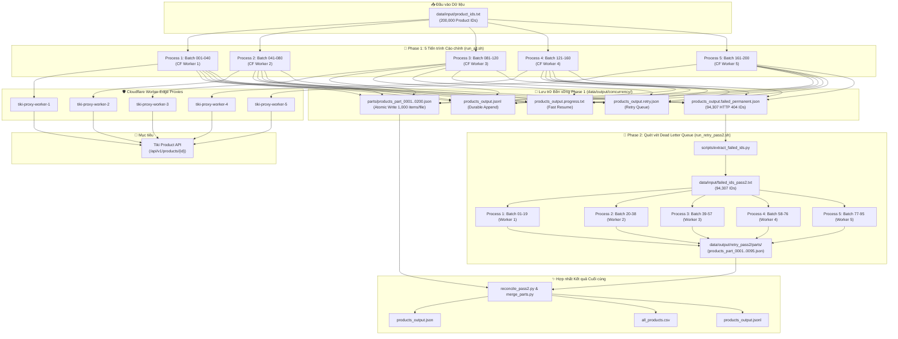
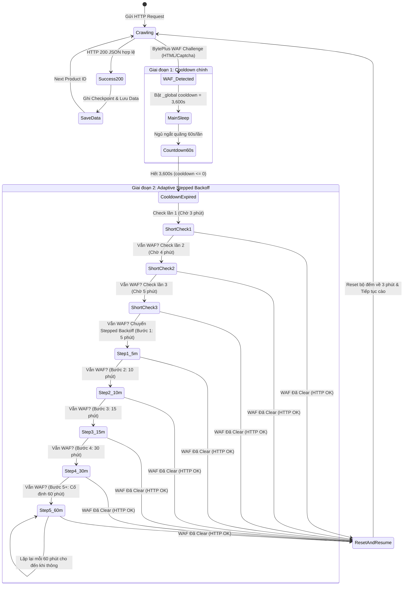

# 🛒 Tiki Product Data Crawler & Pipeline (Project 2 - Data Engineer)

Hệ thống crawl và chuẩn hóa dữ liệu lớn cho **200,000 sản phẩm** từ Tiki API (`https://api.tiki.vn/product-detail/api/v1/products/{id}`). Hệ thống được thiết kế với kiến trúc chịu lỗi (fault-tolerant), tối ưu hóa hiệu năng cao bằng lập trình bất đồng bộ (`asyncio` + `aiohttp`), tích hợp cơ chế chống thất thoát dữ liệu đa tầng (Durable Append, Atomic Writes, Multi-layer Checkpointing) và cơ chế vượt qua các lớp bảo vệ chống scraping (BytePlus WAF / Rate Limiter).

---

## 📑 Mục Lục
1. [Cấu trúc thư mục dự án](#1-cấu-trúc-thư-mục-dự-án)
2. [Kiến trúc & Sơ đồ luồng hệ thống (System Architecture & Pipeline Flow)](#2-kiến-trúc--sơ-đồ-luồng-hệ-thống-system-architecture--pipeline-flow)
3. [Quy chuẩn dữ liệu đầu ra & Làm sạch HTML](#3-quy-chuẩn-dữ-liệu-đầu-ra--làm-sạch-html)
4. [Bảng phân loại & Xử lý các trường hợp lỗi](#4-bảng-phân-loại--xử-lý-các-trường-hợp-lỗi)
   - [Cơ chế WAF Adaptive Stepped Backoff (Tối ưu hóa thời gian quét lại)](#-cơ-chế-waf-adaptive-stepped-backoff-tối-ưu-hóa-thời-gian-quét-lại)
5. [Hướng dẫn cài đặt & Cách chạy Source Code](#5-hướng-dẫn-cài-đặt--cách-chạy-source-code)
   - [Bước 5: Chạy Tự vận hành Không chạm Phase 1 (200k ID)](#bước-5-chạy-tự-vận-hành-không-chạm-zero-touch-unattended-automation)
   - [Bước 6: Phase 2 - Quét vét 94,307 ID lỗi (Dead Letter Queue)](#bước-6-phase-2-quét-vét-94307-id-lỗi-dead-letter-queue-re-crawl)
6. [Theo dõi tiến độ & Thống kê thời gian](#6-theo-dõi-tiến-độ--thống-kê-thời-gian)
7. [Xử lý sự cố (Troubleshooting)](#7-xử-lý-sự-cố-troubleshooting)
8. [Chạy Unit Test](#8-chạy-unit-test)

---

## 📁 1. Cấu trúc thư mục dự án

```
Project_2/
├── fetch_tiki_products.py            # Engine cào Concurrency (Checkpoint 5 lớp, Retry Queue, Dynamic Cooldown)
├── fetch_tiki_products_sequential.py # Engine cào Tuần tự (Sequential) phục vụ test & debug chi tiết
├── main.py                           # CLI Entry point cào theo batch (hỗ trợ Adaptive Stepped Backoff)
├── crawler.py                        # Batch streaming crawler engine
├── cleaner.py                        # Module chuẩn hoá description & bóc tách cấu trúc HTML
├── config.py                         # File cấu hình tập trung (URL, Headers, Timeouts, Paths)
├── requirements.txt                  # Danh sách thư viện phụ thuộc (aiohttp, pytest, ...)
├── README.md                         # Tài liệu hướng dẫn toàn diện của dự án
├── run_all.sh                        # Script chạy 5 tiến trình ngầm cho Phase 1 (200k ID)
├── stop_all.sh                       # Script dừng khẩn cấp 5 tiến trình Phase 1
├── check_status.py                   # Dashboard theo dõi tiến độ Phase 1 thời gian thực
├── merge_parts.py                    # Script hợp nhất các file batch parts thành JSON, JSONL, CSV
├── run_retry_pass2.sh                # Script chạy 5 tiến trình ngầm cho Phase 2 (quét vét 94k ID lỗi)
├── stop_retry_pass2.sh               # Script dừng khẩn cấp 5 tiến trình Phase 2
├── check_retry_status.py             # Dashboard theo dõi tiến độ & sản phẩm vớt được của Phase 2
├── reconcile_pass2.py                # Script đối chiếu & hợp nhất sản phẩm vớt được từ Phase 2 vào bộ dữ liệu chính
├── scripts/
│   ├── setup_daemon.sh               # Cài đặt macOS LaunchAgent tự cào ngầm khi khởi động máy
│   └── extract_failed_ids.py         # Trích xuất danh sách ID lỗi 404 sang failed_ids_pass2.txt
├── tests/                            # Bộ kiểm thử đơn vị tự động (Unit Tests)
│   ├── test_crawler.py
│   └── test_fetch_tiki_products.py
└── data/
    ├── input/                        # Danh sách product_id đầu vào
    │   ├── product_ids.txt           # Danh sách đầy đủ 200,000 ID
    │   ├── product_ids_10.txt        # Tập ID mẫu 10 sản phẩm
    │   ├── product_ids_50.txt        # Tập ID mẫu 50 sản phẩm
    │   └── failed_ids_pass2.txt      # 94,307 ID lỗi trích xuất cho Phase 2
    └── output/
        ├── concurrency/              # Kết quả xuất ra từ Phase 1
        │   ├── parts/                # Các file batch (1,000 items/file)
        │   ├── products_output.json               # Dữ liệu JSON hoàn chỉnh (Atomic Write)
        │   ├── products_output.jsonl              # Stream ghi từng dòng (Durable Append)
        │   ├── products_output.progress.txt       # Danh sách ID đã cào thành công
        │   ├── products_output.retry.json         # Trạng thái hàng đợi retry & global cooldown
        │   ├── products_output.failed_permanent.json # Danh sách ID lỗi vĩnh viễn (404, format sai, hết retry)
        │   └── products_output.stats.json         # Thống kê tổng thời gian chạy, tốc độ trung bình
        ├── retry_pass2/              # Kết quả quét vét Phase 2 (Tách biệt hoàn toàn để bảo vệ Phase 1)
        │   └── parts/                # 95 file batch quét lại (products_part_0001.json -> 0095.json)
        └── sequential/               # Kết quả xuất ra từ fetch_tiki_products_sequential.py
```

---

## 🏗️ 2. Kiến trúc & Sơ đồ luồng hệ thống (System Architecture & Pipeline Flow)

### 📊 Sơ đồ Tổng thể Pipeline (End-to-End Architecture)



---

### 🛡️ Sơ đồ Chu kỳ Xử lý WAF & Adaptive Stepped Backoff



---

### Các Engine cào dữ liệu:

Hệ thống cung cấp **3 chế độ thực thi** phù hợp với từng nhu cầu:

#### 1. Concurrency Engine (`fetch_tiki_products.py`) - Khuyến nghị cho Production
- **Lập trình bất đồng bộ (`asyncio` + `aiohttp`)**: Quản lý connection pool với keep-alive, pacing request ngẫu nhiên tự nhiên (`NaturalPacer`).
- **Worker Pool có gắn nhãn**: Log mỗi request đều hiển thị `[Worker N]` để theo dõi worker nào đang xử lý ID nào. Hỗ trợ từ **1 đến 20 workers** đồng thời (mặc định: 20).
- **Cung cấp public API `run_product_ids()`**: Cho phép các module khác (như `main.py`) gọi trực tiếp engine với danh sách ID tùy chỉnh, tái sử dụng toàn bộ logic retry/checkpoint.
- **Cơ chế Checkpoint đa lớp**:
  - `products_output.jsonl`: Append từng bản ghi và `fsync` ngay lập tức chống mất dữ liệu khi crash/tắt đột ngột.
  - `products_output.progress.txt`: Tập hợp ID đã thành công giúp Resume tức thì mà không cần duyệt lại JSON lớn.
  - `products_output.json`: File tổng hợp được cập nhật bằng cơ chế **Atomic Write** (ghi ra `.tmp` rồi rename/replace), đảm bảo không bao giờ bị corrupt.
  - `products_output.retry.json`: Quản lý số lần thử (`attempts`), lý do lỗi (`reason`), thời điểm retry (`next_retry_at`) và cooldown toàn cục (`_global`).
  - `products_output.failed_permanent.json`: Tách riêng các ID không thể cào (404, payload sai định dạng, đã hết lượt retry).
  - `products_output.stats.json`: Ghi nhận và tích lũy tổng thời gian cào qua nhiều lần chạy, tính tốc độ trung bình.

#### 2. Batch Streaming Engine (`main.py`)
- **Refactored**: `main.py` dùng trực tiếp `run_product_ids()` từ `fetch_tiki_products.py` — tái sử dụng toàn bộ cơ chế retry/checkpoint/cooldown.
- **Tự động chia file theo Batch**: Cứ mỗi `--batch-size` (mặc định 1,000) sản phẩm sẽ đóng gói thành một file riêng (`products_part_0001.json`, `products_part_0002.json`, ...) trong thư mục `data/output/concurrency/parts/` (hoặc `data/output/retry_pass2/parts/`).
- **Log trạng thái chi tiết từng batch**: Trước và sau mỗi batch đều in ra số lượng `success`, `permanent_failed`, `due`, `pending_retry` và `cooldown` để theo dõi tiến độ toàn pipeline.
- **Tích hợp Adaptive Stepped Backoff**: Tự động xử lý thông minh khi hết cooldown WAF, không cần con người can thiệp.

#### 3. Sequential Engine (`fetch_tiki_products_sequential.py`)
- **Cào tuần tự từng sản phẩm**: Sử dụng để debug sâu, kiểm tra phản hồi header/body chi tiết của server Tiki khi gặp lỗi.

---

## 📋 3. Quy chuẩn dữ liệu đầu ra & Làm sạch HTML

Mỗi bản ghi sản phẩm được lưu trữ theo cấu trúc chuẩn JSON sau:

```json
{
  "id": 138083218,
  "name": "Đồ Chơi Xếp Hình MyndToys - My First Learning (Cho Bé Từ 2.5 Tuổi - Nhiều Chủ Đề)",
  "url_key": "do-choi-xep-hinh-myndtoys-my-first-learning-cho-be-tu-2-5-tuoi-nhieu-chu-de-p138083218",
  "price": 268000,
  "description": "Đồ Chơi Xếp Hình MyndToys - My First Learning (Cho Bé Từ 2.5 Tuổi - Nhiều Chủ Đề)\n\nĐặc điểm nổi bật:\n- Chất liệu gỗ an toàn cho bé\n- Giúp phát triển tư duy logic",
  "images_url": [
    "https://salt.tikicdn.com/media/catalog/product/f5/15/2228f38cf84d1b8451bb49e2c4537081.png"
  ]
}
```

### Quy trình chuẩn hóa `description` trong `cleaner.py`:
- **Loại bỏ thẻ rác**: Xóa sạch toàn bộ thẻ `<script>`, `<style>`, `<iframe>` cùng nội dung bên trong.
- **Bóc tách khối HTML**: Chuyển các thẻ khối (`<p>`, `<div>`, `<li>`, `<h1>`-`<h6>`, `<br>`) thành dấu xuống dòng `\n` có nghĩa.
- **Giải mã HTML Entities**: Chuyển đổi các ký tự mã hóa như `&nbsp;`, `&amp;`, `&quot;`, `&lt;`, `&gt;`, `&#39;` thành ký tự văn bản thông thường.
- **Làm sạch khoảng trắng**: Loại bỏ khoảng trắng không ngắt (`\xa0`, `\u200b`), chuẩn hóa khoảng trắng thừa giữa các dòng và đoạn văn.

---

## ⚠️ 4. Bảng phân loại & Xử lý các trường hợp lỗi

Mọi phản hồi từ Tiki API đều được phân loại nghiêm ngặt thành **3 nhóm trạng thái**:

| Nhóm | Mã `reason` ghi nhận | Nguyên nhân chi tiết | Cơ chế xử lý & Retry | File lưu trữ |
| :--- | :--- | :--- | :--- | :--- |
| **`challenge`** | `html_security_challenge` | BytePlus / Tiki WAF phát hiện bot, trả về trang HTML chứa Security Check/Captcha thay vì JSON. | Ngắt toàn bộ worker ngay lập tức (`stop_event`), bật `_global` cooldown tối thiểu **3600s** (1 giờ) để chống bị ban IP nặng. | `*.retry.json` (`_global` & ID) |
| **`retry`** | `http_429` | Bị Rate Limit do tần suất request quá nhanh. | Đọc header `Retry-After` (nếu có) hoặc kích hoạt Exponential Backoff (`30s, 120s, 600s`). | `*.retry.json` |
| **`retry`** | `http_403` | Bị từ chối truy cập tạm thời. | Ưu tiên `Retry-After` hoặc exponential backoff. | `*.retry.json` |
| **`retry`** | `http_500`, `http_502`, `http_503`, `http_504` | Lỗi máy chủ phía Tiki bị quá tải hoặc gián đoạn dịch vụ. | Chờ server phục hồi theo `Retry-After` hoặc backoff. | `*.retry.json` |
| **`retry`** | `timeout` | Quá thời gian timeout khi gọi HTTP (mạng chập chờn, server không phản hồi). | Tăng số lần thử (`attempts`), đưa vào hàng đợi chờ thử lại. | `*.retry.json` |
| **`retry`** | `ClientConnectorError`, `ServerDisconnectedError`,... | Lỗi kết nối mạng vật lý hoặc đứt socket từ `aiohttp`. | Ghi nhận tên Exception (`type(exc).__name__`), đưa vào retry. | `*.retry.json` |
| **`retry`** | `invalid_content_type` | Mã HTTP 200 nhưng header `Content-Type` không chứa `json`. | Thử lại theo chu kỳ backoff. | `*.retry.json` |
| **`retry`** | `invalid_json` | Body trả về bị cắt ngắn hoặc hỏng không parse được bằng `json.loads()`. | Thử lại theo chu kỳ backoff. | `*.retry.json` |
| **`retry`** | `soft_block_missing_fields:<field>` | HTTP 200 nhưng JSON thiếu các field bắt buộc (`id`, `name`, `price`) — WAF trả payload giả để đánh lừa crawler. | Tăng `attempts`, thử lại thận trọng theo backoff. | `*.retry.json` |
| **`terminal`** | `http_404` | Sản phẩm không tồn tại hoặc đã bị xóa vĩnh viễn khỏi Tiki. | **Không thử lại**, đánh dấu lỗi vĩnh viễn. | `*.failed_permanent.json` |
| **`terminal`** | `invalid_product_payload` | JSON parse thành công nhưng không phải kiểu `dict` hoặc không có field `id`. | **Không thử lại**, đánh dấu lỗi vĩnh viễn. | `*.failed_permanent.json` |
| **`terminal`** | `http_<status>` *(400, 401,...)* | Các mã lỗi HTTP client bất thường khác. | **Không thử lại**, đánh dấu lỗi vĩnh viễn. | `*.failed_permanent.json` |
| **`terminal`** | *Hết lượt retry (`attempts > 3`)* | Đã retry đủ số lần backoff tối đa mà vẫn tiếp tục lỗi. | Tự động chuyển từ retry queue sang danh sách lỗi vĩnh viễn. | `*.failed_permanent.json` |

---

### ⏱️ Cơ chế WAF Adaptive Stepped Backoff (Tối ưu hóa thời gian quét lại)

Khi hệ thống gặp BytePlus Security Challenge từ Tiki, thay vì chờ cứng 60 phút ở mọi lần hoặc liên tục bắn request khiến IP bị chặn vĩnh viễn, crawler áp dụng giải thuật **Adaptive Stepped Backoff** thông minh:

#### 1. Nguyên lý 2 giai đoạn:
- **Giai đoạn 1 (Cooldown chính):**
  - Kích hoạt `_global` cooldown = **3,600 giây** (60 phút) ngay khi phát hiện HTML Security Challenge.
  - Tiến trình ngủ ngắt quãng theo chu kỳ (mặc định 60s) để có thể nhận lệnh dừng (`SIGINT`/`SIGTERM`) mà không bị treo.
- **Giai đoạn 2 (Adaptive Stepped Check sau Cooldown):**
  - **3 Lần đầu tiên (Thử nghiệm nhanh):** Sau khi hết 60 phút cooldown chính, hệ thống kiểm tra với khoảng cách ngắn **3 đến 5 phút** (3m → 4m → 5m). Nếu WAF đã gỡ chặn, crawler lập tức tiếp tục cào ngay, tiết kiệm hàng chục phút chờ đợi không cần thiết.
  - **Nếu sau 3 lần vẫn bị WAF:** Chuyển sang chu kỳ Stepped Backoff với các bước giãn cách tăng dần:
    - **Bước 1:** Chờ **5 phút**
    - **Bước 2:** Chờ **10 phút**
    - **Bước 3:** Chờ **15 phút**
    - **Bước 4:** Chờ **30 phút**
    - **Bước 5+:** Cố định ở mức **60 phút** (giữ nguyên chu kỳ 60 phút cho tới khi WAF hoàn toàn clear).
- **Cơ chế Auto-Reset:**
  - Ngay khi có 1 lần kiểm tra thành công (WAF clear, nhận JSON hợp lệ), toàn bộ bộ đếm adaptive check và khoảng thời gian chờ được **tự động reset về mức 3 phút ban đầu**.

#### 2. Bảng tham chiếu thời gian Adaptive Backoff:
| Lượt kiểm tra | Thời gian chờ (Interval) | Trạng thái / Hành động |
| :--- | :--- | :--- |
| **Cooldown chính** | 3,600 giây (60 phút) | Ngủ bắt buộc sau khi dính BytePlus Challenge |
| **Check 1** | **3 phút** | Kiểm tra nhanh lần 1 sau cooldown chính |
| **Check 2** | **4 phút** | WAF vẫn chặn → Kiểm tra nhanh lần 2 |
| **Check 3** | **5 phút** | WAF vẫn chặn → Kiểm tra nhanh lần 3 |
| **Bước 1 (Stepped)** | **5 phút** | Chuyển sang Stepped Backoff bước 1 |
| **Bước 2 (Stepped)** | **10 phút** | WAF dai dẳng → Giãn cách lên 10 phút |
| **Bước 3 (Stepped)** | **15 phút** | Giãn cách lên 15 phút |
| **Bước 4 (Stepped)** | **30 phút** | Giãn cách lên 30 phút |
| **Bước 5+ (Stepped)**| **60 phút** | Cố định ở 60 phút lặp lại vô hạn đến khi mở |
| **Thành công** | **Reset 3 phút** | Tự động reset bộ đếm về ban đầu |

---

## 🚀 5. Hướng dẫn cài đặt & Cách chạy Source Code

### Bước 1: Chuẩn bị môi trường

```bash
# Tạo môi trường ảo Python
python3 -m venv venv

# Kích hoạt môi trường ảo
source venv/bin/activate

# Cài đặt các thư viện cần thiết
pip install -r requirements.txt
```

---

### Bước 2: Chạy Concurrency Engine (`fetch_tiki_products.py`)

#### 1. Chạy thử nghiệm với 10 sản phẩm mẫu:
```bash
python3 fetch_tiki_products.py \
  --input data/input/product_ids_10.txt \
  --output data/output/concurrency/products_output.json \
  --concurrency 1 \
  --delay-min 2.0 \
  --delay-max 5.0
```

#### 2. Chạy chính thức toàn bộ 200,000 sản phẩm:
```bash
python3 fetch_tiki_products.py \
  --input data/input/product_ids.txt \
  --output data/output/concurrency/products_output.json \
  --concurrency 20 \
  --delay-min 0.3 \
  --delay-max 1.0
```

#### 📌 Danh sách các tham số CLI của `fetch_tiki_products.py`:
| Tham số | Kiểu dữ liệu | Mặc định | Mô tả |
| :--- | :--- | :--- | :--- |
| `--input` | `Path` | `data/input/product_ids.txt` | Đường dẫn file danh sách ID đầu vào |
| `--output` | `Path` | `data/output/concurrency/products_output.json` | Đường dẫn file kết quả JSON |
| `--limit` | `int` | `0` *(lấy hết)* | Giới hạn số lượng ID cần xử lý (vd: `--limit 500`) |
| `--concurrency` | `int` | **`20`** *(1-20)* | Số worker bất đồng bộ chạy song song |
| `--delay-min` | `float` | `2.0` | Thời gian giãn cách tối thiểu giữa các request (giây) |
| `--delay-max` | `float` | `8.0` | Thời gian giãn cách tối đa giữa các request (giây) |
| `--timeout` | `float` | `20.0` | Thời gian timeout cho mỗi request (giây) |
| `--worker-url` | `str` | `None` *(Tiki API)* | URL Cloudflare Worker Edge Proxy (vd: `https://tiki-proxy-worker.tyanh185.workers.dev`) |

---

### Bước 3: Chạy Sequential Engine (`fetch_tiki_products_sequential.py`)

Dùng để cào tuần tự từng sản phẩm phục vụ kiểm tra lỗi:

```bash
python3 fetch_tiki_products_sequential.py \
  --input data/input/product_ids_10.txt \
  --output data/output/squential/products_sequential_output.json \
  --delay-min 0.8 \
  --delay-max 2.0
```

---

### Bước 4: Chạy Batch Streaming Engine (`main.py`)

Dùng khi cần tự động phân tách kết quả thành nhiều file nhỏ (mỗi file chứa 1,000 sản phẩm, lưu tại `data/output/concurrency/parts/`):

```bash
python3 main.py \
  --input data/input/product_ids.txt \
  --output-dir data/output/concurrency/parts \
  --concurrency 20 \
  --batch-size 1000 \
  --start-batch 1 \
  --end-batch 0 \
  --delay-min 0.3 \
  --delay-max 1.0
```

#### ⚡ Chạy Hybrid song song 2 Process (Tiki Direct + Cloudflare Worker Proxy):
Tận dụng 2 dải IP riêng biệt để cào 200,000 ID không bị WAF/Rate limit:

```bash
# Process 1: 100k ID đầu chạy trực tiếp Tiki API (IP mạng nhà)
python3 main.py \
  --input data/input/product_ids_part1.txt \
  --output-dir data/output/concurrency/parts \
  --concurrency 10 \
  --delay-min 1.0 \
  --delay-max 3.0

# Process 2: 100k ID sau chạy qua Cloudflare Worker Edge Proxy (IP Cloudflare)
python3 main.py \
  --input data/input/product_ids_part2.txt \
  --output-dir data/output/concurrency/parts \
  --concurrency 15 \
  --delay-min 1.0 \
  --delay-max 3.0 \
  --worker-url https://tiki-proxy-worker.tyanh185.workers.dev
```

Trong PyCharm: tạo 2 Run Configuration kiểu Python, chọn script `main.py`, bật **Allow parallel run**, rồi điền tương ứng vào ô `Parameters`.

---

### Bước 5: Chạy Tự vận hành Không chạm (Zero-Touch Unattended Automation)

Hệ thống cung cấp trọn bộ script tự động hóa hoàn toàn 200,000 sản phẩm chia cho 5 Cloudflare Worker Proxies, tích hợp cơ chế **Auto-Wait Loop** (bị WAF thì tự ngủ đếm ngược rồi tự cào tiếp, không thoát tiến trình) và **macOS LaunchAgent** (tự chạy ngầm khi mở máy):

#### 1. Khởi chạy 5 Process song song bằng 1 lệnh duy nhất:
```bash
./run_all.sh
```
* Tự động kiểm tra kết nối WiFi/Internet (chờ đến khi có mạng mới bắt đầu).
* Tự động kích hoạt song song 5 process tương ứng 5 dải batch:
  - **Process 1**: Batch 0001 - 0040 qua `tiki-proxy-worker-1` (Log: `logs/p1.log`)
  - **Process 2**: Batch 0041 - 0080 qua `tiki-proxy-worker-2` (Log: `logs/p2.log`)
  - **Process 3**: Batch 0081 - 0120 qua `tiki-proxy-worker-3` (Log: `logs/p3.log`)
  - **Process 4**: Batch 0121 - 0160 qua `tiki-proxy-worker-4` (Log: `logs/p4.log`)
  - **Process 5**: Batch 0161 - 0200 qua `tiki-proxy-worker-5` (Log: `logs/p5.log`)

#### 2. Dừng khẩn cấp toàn bộ 5 Process:
```bash
./stop_all.sh
```

#### 3. Cài đặt tự động chạy khi mở máy trên macOS (LaunchAgent Background Daemon):
```bash
# Cài đặt và kích hoạt tự khởi chạy khi đăng nhập/mở máy:
bash scripts/setup_daemon.sh install

# Xem trạng thái dịch vụ ngầm:
bash scripts/setup_daemon.sh status

# Tạm dừng hoặc khởi động lại:
bash scripts/setup_daemon.sh stop
bash scripts/setup_daemon.sh start

# Gỡ bỏ hoàn toàn daemon:
bash scripts/setup_daemon.sh uninstall
```
* **Đặc tính Daemon**:
  - `RunAtLoad = true`: Mở máy hoặc đăng nhập là tự động chạy ngầm.
  - `KeepAlive`: Tự khởi động lại nếu sập nguồn, mất WiFi đột ngột.
  - Khi cào xong toàn bộ 200 batch (exit code 0), dịch vụ tự động kết thúc hoàn toàn.

#### 4. Xem Dashboard giám sát thời gian thực:
```bash
python3 check_status.py
```
* Hiển thị bảng trạng thái chi tiết của 5 tiến trình: PID, CPU %, thời gian chạy, batch đang xử lý, và tổng tiến độ % trên toàn bộ 200,000 ID.

#### 5. Tổng hợp dữ liệu từ các Batch Parts:
```bash
python3 merge_parts.py
```
* Tự động quét và hợp nhất toàn bộ các file part trong `data/output/concurrency/parts/`, loại bỏ trùng lặp bằng set và xuất ra 3 định dạng: `products_output.json`, `products_output.jsonl`, và `all_products.csv`.

---

### Bước 6: Phase 2 - Quét vét 94,307 ID lỗi (Dead Letter Queue Re-crawl)

Sau khi hoàn tất Phase 1 thu thập thành công 105,693 sản phẩm, hệ thống ghi nhận 94,307 ID rơi vào trạng thái `http_404`. Để tối đa hóa tỷ lệ dữ liệu thu thập được (phòng trường hợp 404 giả do WAF hoặc lỗi mạng chập chờn), Phase 2 được thiết kế để **quét vét lại toàn bộ danh sách ID này** với cơ chế bảo vệ dữ liệu tuyệt đối:

- **Cách ly thư mục đầu ra:** Kết quả lưu tại `data/output/retry_pass2/parts/` để không làm ảnh hưởng đến dữ liệu Phase 1.
- **5 Tiến trình ngầm song song:** 95 batches chia đều cho 5 Cloudflare Worker Proxies.
- **Tích hợp Adaptive Stepped Backoff:** Tự động giãn cách thời gian chờ khi gặp WAF (3-5m check x 3 lần → 5m → 10m → 15m → 30m → 60m).

#### 1. Trích xuất danh sách ID lỗi từ Phase 1:
```bash
python3 scripts/extract_failed_ids.py
```
* Đọc từ `data/output/concurrency/products_output.failed_permanent.json` và tạo ra `data/input/failed_ids_pass2.txt` (chứa chính xác 94,307 ID duy nhất).

#### 2. Khởi chạy 5 Process quét lỗi ngầm:
```bash
./run_retry_pass2.sh
```
* Tự động khởi động 5 tiến trình chạy nền:
  - **Process 1:** Batch 0001 – 0019 qua `tiki-proxy-worker-1` (Log: `logs/retry_p1.log`)
  - **Process 2:** Batch 0020 – 0038 qua `tiki-proxy-worker-2` (Log: `logs/retry_p2.log`)
  - **Process 3:** Batch 0039 – 0057 qua `tiki-proxy-worker-3` (Log: `logs/retry_p3.log`)
  - **Process 4:** Batch 0058 – 0076 qua `tiki-proxy-worker-4` (Log: `logs/retry_p4.log`)
  - **Process 5:** Batch 0077 – 0095 qua `tiki-proxy-worker-5` (Log: `logs/retry_p5.log`)
* Lưu PIDs vào `logs/retry_crawler.pids` để quản lý tập trung.

#### 3. Theo dõi Dashboard Phase 2 thời gian thực:
```bash
python3 check_retry_status.py
```
* Theo dõi tiến độ 95 batches, tốc độ xử lý, và đặc biệt là **tổng số sản phẩm vớt được** từ tập ID lỗi.

#### 4. Dừng khẩn cấp toàn bộ tiến trình Phase 2:
```bash
./stop_retry_pass2.sh
```

#### 5. Đối chiếu & Hợp nhất sản phẩm vớt được sau khi hoàn tất:
```bash
python3 reconcile_pass2.py
```
* Tự động quét toàn bộ `data/output/retry_pass2/parts/`, trích xuất các sản phẩm cứu được và hợp nhất vào bộ dữ liệu chính mà không làm trùng lặp ID.

---

## 📊 6. Theo dõi tiến độ & Thống kê thời gian

Khi chạy `fetch_tiki_products.py`, hệ thống tự động tính toán và lưu thời gian cào dữ liệu vào file `*.stats.json` (tích lũy qua mọi lần chạy/resume):

### File thống kê mẫu `products_output.stats.json`:
```json
{
  "total_products_saved": 100,
  "total_time_seconds": 215.4,
  "total_time_formatted": "00:03:35",
  "total_time_human": "3 phút 35 giây",
  "average_seconds_per_product": 2.15,
  "average_speed": "2.15s / sản phẩm",
  "last_run_duration_seconds": 45.2,
  "last_run_duration": "45.2s",
  "updated_at": "2026-09-05 17:40:00 +0700"
}
```

### Log tổng kết khi kết thúc lượt chạy:
```text
Kết thúc lượt chạy:
  ⏱️ Thời gian lượt này    : 45.2s
  ⌛ Tổng thời gian tích lũy : 3 phút 35 giây (00:03:35)
  ⚡ Tốc độ trung bình      : 2.15s / sản phẩm
  ✅ Mới lưu thành công     : 25
  ⏳ Lỗi tạm thời (retry)  : 0
  ❌ Lỗi vĩnh viễn         : 2 (tổng tích lũy: 5)
  📦 Tổng đã lưu            : 100
  📄 Output                 : data/output/concurrency/products_output.json
  📊 Stats                  : data/output/concurrency/products_output.stats.json
  🚫 Permanent fails        : data/output/concurrency/products_output.failed_permanent.json
```

---

## 🛠️ 7. Xử lý sự cố (Troubleshooting)

### 1. Xóa `_global` Cooldown sau khi đổi IP / VPN:
Khi bị dính BytePlus Security Challenge, hệ thống sẽ tự động bật cooldown 1 giờ để bảo vệ IP. Sau khi bạn đã đổi IP mới (qua proxy/VPN/mạng khác), hãy xóa cooldown bằng lệnh:

```bash
python3 -c "
import json
p = 'data/output/concurrency/products_output.retry.json'
try:
    d = json.load(open(p))
    d.pop('_global', None)
    open(p, 'w').write(json.dumps(d, indent=2))
    print('✅ Đã xóa _global cooldown thành công!')
except Exception as e:
    print('Lỗi:', e)
"
```

### 2. Reset toàn bộ hàng đợi Retry:
Nếu muốn thử lại tất cả các ID bị lỗi trước đó:
```bash
echo "{}" > data/output/concurrency/products_output.retry.json
```

### 3. Tiếp tục cào lại sau khi dừng (Resume):
Chỉ cần chạy lại lệnh ban đầu, script sẽ tự động đọc `products_output.progress.txt` và bỏ qua tất cả các ID đã cào thành công.

---

## 🧪 8. Chạy Unit Test

Kiểm thử toàn bộ các module xử lý dữ liệu và logic cào:

```bash
python3 -m unittest discover tests
```
