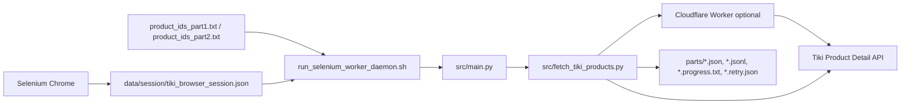

# Tiki Selenium Worker Hybrid

Nhánh `selenium-worker-hybrid` dùng để thử nghiệm mô hình crawl Tiki kết hợp:

- Selenium Chrome: lấy `cookie` và `user_agent` từ trình duyệt thật.
- Cloudflare Worker: proxy tùy chọn để tách endpoint/IP khỏi máy local.
- `aiohttp` crawler: vẫn là engine crawl chính để giữ tốc độ, checkpoint và resume.

Selenium không được dùng để mở 200,000 trang sản phẩm. Selenium chỉ bootstrap browser session; dữ liệu sản phẩm vẫn lấy từ API:

```text
https://api.tiki.vn/product-detail/api/v1/products/{product_id}
```

## Mô Hình



## Source Chính

```text
src/
  main.py                     Batch orchestrator, chia output theo part 1000 sản phẩm
  fetch_tiki_products.py      Async crawler, retry queue, WAF backoff, cookie-file
  cleaner.py                  Chuẩn hóa description và bóc tách field cần lấy
  config.py                   API base URL, headers, timeout, defaults

tools/
  capture_tiki_browser_session.py   Mở Chrome Selenium và lưu cookie/user-agent
  merge_parts.py                    Merge output parts khi cần tổng hợp

runners/
  run_selenium_worker_daemon.sh      Chạy nền, auto-wait, auto-resume
  stop_selenium_worker_daemon.sh     Dừng daemon theo PID file

requirements.txt             Dependency crawler chính
requirements-selenium.txt    Dependency Selenium riêng cho nhánh thử nghiệm
```

Các output runtime như `data/session/`, `data/output/selenium_worker_test/`, `logs/` không được push lên GitHub.

## Cài Đặt

```bash
./venv/bin/python -m pip install -r requirements.txt
./venv/bin/python -m pip install -r requirements-selenium.txt
```

Nếu Selenium chưa mở được Chrome, cập nhật Chrome lên bản mới. Selenium 4 sẽ tự xử lý ChromeDriver qua Selenium Manager trong đa số trường hợp.

## Bước 1: Capture Browser Session

Chạy lệnh này trước để tạo file cookie:

```bash
./venv/bin/python tools/capture_tiki_browser_session.py \
  --output data/session/tiki_browser_session.json \
  --worker-url https://tiki-proxy-worker.tyanh185.workers.dev \
  --wait-seconds 8
```

Kết quả:

```text
data/session/tiki_browser_session.json
```

File này chứa cookie/session local, không commit lên GitHub.

## Bước 2: Chạy 200,000 ID Bằng 2 Daemon

Khuyến nghị dùng 2 input đã chia sẵn:

```text
data/input/product_ids_part1.txt
data/input/product_ids_part2.txt
```

### Process 1: Part 1, Gọi Tiki Direct

```bash
./runners/run_selenium_worker_daemon.sh --name tiki_part1_direct -- \
  --input data/input/product_ids_part1.txt \
  --output-dir data/output/selenium_worker_test/part1_parts \
  --batch-size 1000 \
  --concurrency 10 \
  --delay-min 0.8 \
  --delay-max 2.0 \
  --cookie-file data/session/tiki_browser_session.json
```

### Process 2: Part 2, Qua Cloudflare Worker

```bash
./runners/run_selenium_worker_daemon.sh --name tiki_worker -- \
  --input data/input/product_ids_part2.txt \
  --output-dir data/output/selenium_worker_test/parts \
  --batch-size 1000 \
  --concurrency 10 \
  --delay-min 0.8 \
  --delay-max 2.0 \
  --worker-url https://tiki-proxy-worker.tyanh185.workers.dev \
  --cookie-file data/session/tiki_browser_session.json
```

Không cho 2 process ghi cùng một `--output-dir`, vì batch `products_part_0001.json` sẽ bị trùng tên.

## Cơ Chế Chạy Nền

`run_selenium_worker_daemon.sh` sẽ:

- chạy `src/main.py` trong background;
- bật `PYTHONUNBUFFERED=1` để log ra nhanh hơn;
- bật `--auto-wait`;
- dùng `caffeinate -dimsu` trên macOS để hạn chế sleep;
- nếu `main.py` thoát do lỗi mạng/process, ngủ 300 giây rồi chạy lại;
- resume theo các file output đã có.

Các file resume chính:

```text
products_part_0001.jsonl
products_part_0001.progress.txt
products_part_0001.retry.json
products_part_0001.failed_permanent.json
products_part_0001.stats.json
```

## WAF Backoff

Khi gặp HTML challenge/WAF:

```text
5 phút -> 15 phút -> 30 phút -> 1 tiếng -> tiếp tục 1 tiếng
```

Crawler ghi cooldown toàn cục vào `*.retry.json` dưới key `_global`. Khi hết cooldown, `main.py` tự chạy tiếp nếu daemon còn hoạt động.

## Theo Dõi

Xem log:

```bash
tail -f logs/tiki_worker.log
tail -f logs/tiki_part1_direct.log
```

Kiểm tra PID:

```bash
cat logs/tiki_worker.pid
cat logs/tiki_part1_direct.pid
```

Kiểm tra process:

```bash
ps -p $(cat logs/tiki_worker.pid) -o pid,ppid,etime,stat,command
ps -p $(cat logs/tiki_part1_direct.pid) -o pid,ppid,etime,stat,command
pgrep -fl "src/main.py|caffeinate|run_selenium_worker_daemon|tiki_worker|tiki_part1_direct"
```

Kiểm tra output có tăng không:

```bash
wc -l data/output/selenium_worker_test/parts/products_part_0004.jsonl
wc -l data/output/selenium_worker_test/part1_parts/products_part_0001.jsonl
```

Kiểm tra batch có cooldown WAF không:

```bash
./venv/bin/python - <<'PY'
import json, time
from pathlib import Path

retry_file = Path("data/output/selenium_worker_test/parts/products_part_0004.retry.json")
if not retry_file.exists():
    print("Chưa có retry file")
else:
    data = json.loads(retry_file.read_text(encoding="utf-8"))
    retry_items = [k for k in data if k != "_global"]
    global_state = data.get("_global")
    print(f"retry_items={len(retry_items)}")
    if global_state and global_state.get("next_retry_at"):
        remaining = max(0, int(float(global_state["next_retry_at"]) - time.time() + 0.999))
        print(f"global_cooldown={remaining}s")
        print(f"reason={global_state.get('reason')}")
    else:
        print("global_cooldown=0s")
PY
```

## Dừng Daemon

```bash
./runners/stop_selenium_worker_daemon.sh --name tiki_worker
./runners/stop_selenium_worker_daemon.sh --name tiki_part1_direct
```

## Chạy Lại / Resume

Chạy lại đúng lệnh cũ, giữ nguyên:

- `--input`
- `--output-dir`
- `--batch-size`

Crawler sẽ tự bỏ qua ID đã có trong `.progress.txt`, giữ lỗi tạm thời trong `.retry.json`, và tiếp tục xử lý các ID đến hạn.

## Lưu Ý

- Nếu gập máy làm macOS sleep sâu, process có thể tạm dừng trong lúc sleep. Khi mở máy/mạng ổn lại, daemon tiếp tục vòng resume.
- Nếu muốn chạy 24/7 thật sự, nên chạy trên VPS thay vì laptop.
- Nếu Cloudflare Worker không forward `Cookie` header về Tiki, `--cookie-file` ở mode Worker có thể không tạo khác biệt. Khi đó kiểm chứng bằng Tiki Direct trước.
- Không tăng concurrency quá nhanh. Mốc thử hiện tại: `--concurrency 10`, `--delay-min 0.8`, `--delay-max 2.0`.

## Test

```bash
./venv/bin/python -m compileall src tools tests
PYTHONPATH=src ./venv/bin/python -m unittest tests.test_fetch_tiki_products
```
